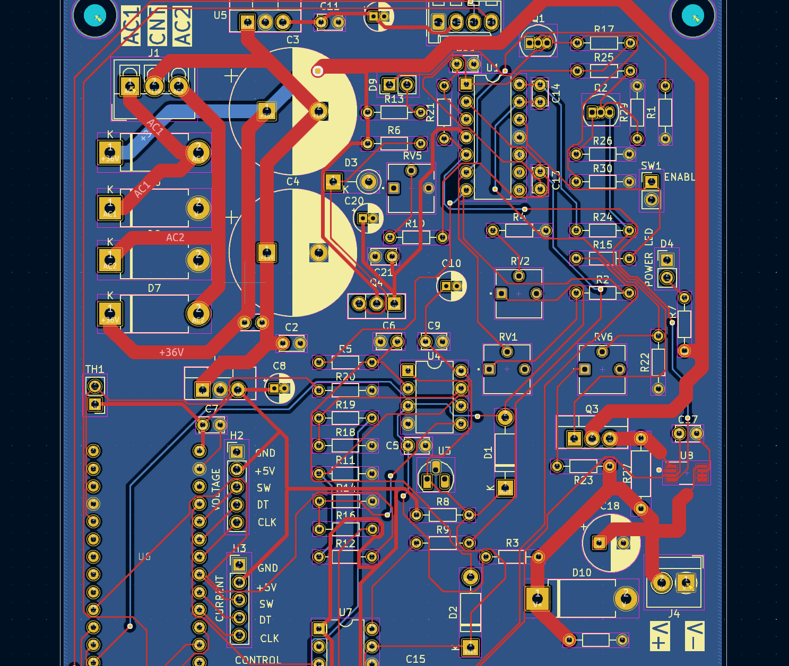
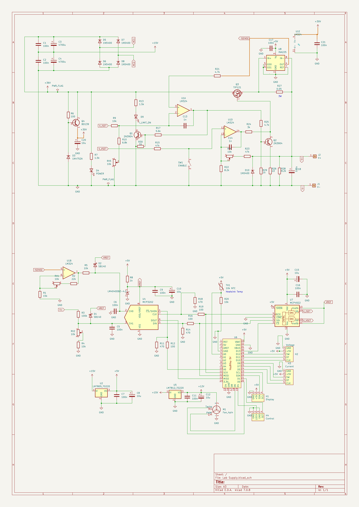

# Linear 0-30V, 2A lab power supply

## Disclaimer

This supply has been built and tested and does work. However, I am a hobbyist doing this to learn. You are
welcome to follow along, but keep the experimental status in mind and always exercise caution when dealing
with electricity!

## Abstract

This project aims to design a high-performance, high-stability microcontroller-based lab power supply. I am
mostly doing this to learn, but also because I'm tired of cheap switchmode power supplies delivering power
riddled with RF noise.

## Principle of operation

### Analog secion

32-36V AC enters the circuit at the `AC1` and `AC2` terminals and gets rectified and smoothed into approximately
36-40V DC. This voltage is then pre-regulated down to 32V through `Q3` which is gets its voltage reference the
backwards bias of `D3`. This voltage is used to power the opamps. The `CNT` input is the transformer center tap, 
which should be aroung 15V and is used to create the +12V and +5V voltages.

The `U1D` opamp acts as a regulation amplifier and expects a voltage between 0-4.096V. The feedback loop is tuned
to 7.32x amplification, resulting in an output voltage ranging from 0-30V. The Darlington pair at `Q3` acts
as a current amplifier.

Current regulation is based on a high-side current sensing resistor, `R27`. The differential voltage across the 
current sense resistor is amplified to a 0-2.5V signal using an INA225 current sense amplifier. This voltage is 
then sent to the positivie input of `U1A`. The control circuitry feeds a 0-4.096V signal
to the `V_ISET` input, which is scaled down to 0-2.5V through a resistor network. This voltage is then fed to the
negative input of `U1A`. When the voltage from the current sense amplifier goes below that of the positive voltage,
the opamp starts will source current to Q2, which brings the base on Q3 low until the current is limited to the 
set value. `Q3` is needed since we want to keep R24 relatively low to avoid voltage drop at high output currents,
while making sure `U1A` isn't sourcing or sinking too much current. `Q1` acts as a simple switch for turning on
the current limit indicator LED.

### Digital section

The digital section is based on a Adafruit ItsyBitsy 5V, which is essentially an Atmel ATMega 32u4 with some
support circuitry. This was chosen to simplify the design and keep everything as through hole. The digital
section is responsible for feeding the `V_VSET` and `V_ISET` voltages to the the analog section, as well
as measuring and presenting actual voltages and currents.

A key component is the LMZ4040DBZ voltage reference, which provides a stable 4.096V reference used by the
rest of the circuit.

The control voltages are generated by an MPC4922 12-bit DAC and fed directly to the analog section. The user
sets the desired voltage and current using two rotary encoders which can be pushed to switch between a "fine"
and "coarse" mode.

The output voltage of the supply is measured by an MCP3202 ADC through a voltage divider network to bring the
voltage down to 0-4.096V. Further overvoltage protection is offered by the `D12` clamping diode. Current is
measured in a similar way, but since that signal is in the 0-1V range, it is first amplified 4.096x by `U1B`.
This signal is also clamped to the 4.096V reference through `D10`.

## Issues and future improvements
The current measuring isn't very linear and has significant drift at higher currents. This may be due to thermal
effects in various components. This is currently compensated in software using calibration tables.

Speaking of calibration, I would like some kind of automated or semi-automated calibration rather than the 
hardcoded calibration tables. 

