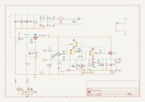

# Linear 0-30V, 2A lab power supply

 

## Disclaimer

This is work in progress and does most likely not work. Also, I am a hobbyist doing this to learn. You are
welcome to follow along, but don't expect anything to work (yet) and always exercise caution when dealing
with electricity!

## Abstract

This project aims to design a high-performance, high-stability microcontroller-based lab power supply. I am
mostly doing this to learn, but also because I'm tired of cheap switchmode power supplies delivering power
riddled with RF noise.

## Principle of operation

### Analog secion

32-36V AC enters the circuit at the `AC1` and `AC2` terminals and gets rectified and smoothed into approximately
36-40V DC. This voltage is then pre-regulated down to 32V through `Q3` which is gets its voltage reference the
backwards bias of `D9`.

The `U1D` opamp acts as a regulation amplifier and expects a voltage between 0-4.096V. The feedback loop is tuned
to 7.32x amplification, resulting in an output voltage ranging from 0-30V. The Darlington pair at `Q1` acts
as a current amplifier.

Current regulation is based on a low-side current sensing resistor, `R6`. The voltage difference with respect to
the internal negative rail voltage is fed to the negative input of `U1C`. The control circuitry feeds a 0-4.096V signal
to the `V_ISET` input, which is scaled down to 0-1V through a resistor network. This voltage is then fed to the
positive input of `U1C`. When the voltage from the current sense resistor goes above that of the positive voltage,
the opamp starts sinking current through `D2`, bringing the base of `Q1` low until the base-emitter current is
lowered enough to bring the current sense voltage at or below the reference on the negative input on `U1C`.

The opamp `U1A` detects any current flowing through `D2` in the forward direction and uses that as an indication
that current limiting is in effect. The output of the opamp is fed to the LED `D3` through a simple driver circuit
based on `Q5`.

An additional protection circuit is based on `Q2`. It senses the difference between the negative output and
the internal negative rail. The voltage divider formed by `R9` and `R11` causes `Q2` to conduct once the current
sense voltage rises above approximately 1V, which corresponds to 2A. This, in turn, will pull the positive
input of the voltage regulating opamp `U1D` low and shut down the regulation loop.

### Digital section

The digital section is based on a Adafruit ItsyBitsy 5V, which is essentially an Atmel ATMega 32u4 with some
support circuitry. This was chosen to simplify the design and keep everything as through hole. The digital
section is responsible for feeding the `V_VSET` and `V_ISET` voltages to the the analog section, as well
as measuring and presenting actual voltages and currents.

A key component is the LMZ4040DBZ voltage reference, which provides a stable 4.096V reference used by the
rest of the circuit.

The control voltages are generated by an MPC4922 12-bit DAC and fed directly to the analog section. The user
sets the desired voltage and current using two rotary encoders which can be pushed to switch between a "fine"
and "coarse" mode.

The output voltage of the supply is measured by an MCP3202 ADC through a voltage divider network to bring the
voltage down to 0-4.096V. Further overvoltage protection is offered by the `D12` clamping diode. Current is
measured in a similar way, but since that signal is in the 0-1V range, it is first amplified 4.096x by `U1B`.
This signal is also clamped to the 4.096V reference through `D10`.

